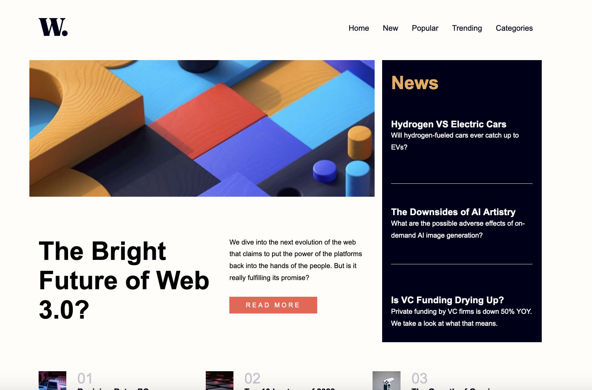

# Frontend Mentor - News homepage solution

This is a solution to the [News homepage challenge on Frontend Mentor](https://www.frontendmentor.io/challenges/news-homepage-H6SWTa1MFl). Frontend Mentor challenges help you improve your coding skills by building realistic projects. 

## Table of contents

- [Overview](#overview)
  - [The challenge](#the-challenge)
  - [Screenshot](#screenshot)
  - [Links](#links)
- [My process](#my-process)
  - [Built with](#built-with)
  - [What I learned](#what-i-learned)
- [Author](#author)

## Overview

### The challenge

Users should be able to:

- View the optimal layout for the interface depending on their device's screen size
- See hover and focus states for all interactive elements on the page
- **Bonus**: Toggle the mobile menu (requires some JavaScript)

### Screenshot

### Links

- Solution URL: [View Solution](https://www.frontendmentor.io/solutions/responsive-landing-page-using-css-grid-and-flexbox-Nycrb8sO57)
- Live Site URL: [View Project](https://mattrhummel.github.io/news-homepage/)

### Built with

- Semantic HTML5 markup
- CSS custom properties
- Flexbox
- CSS Grid
- Mobile-first workflow
- [SASS](https://sass-lang.com/) - CSS Compiler
### What I learned

I've learned how much simpler it is to use grid and flexbox for positioning items. 
## Author

- Website - [Matt Hummel](https://www.matthummel.com)
- Frontend Mentor - [@mattrhummel](https://www.frontendmentor.io/profile//mattrhummel)

